## Part 1. Ready-made docker

Task: Разобраться с базовыми командами работы с докер-образами и контейнерами на примере образа веб-сервера nginx.

- Скачан официальный докер-образ с nginx с помощью команды __`docker pull nginx`__ \
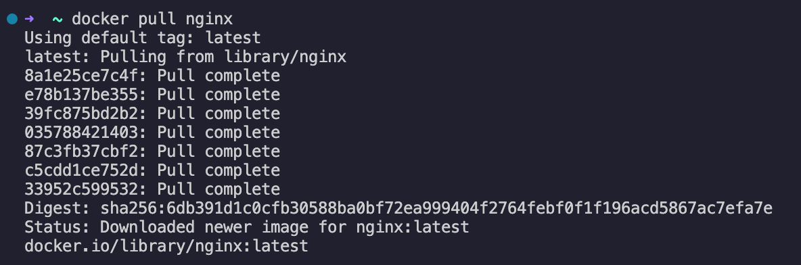

- Образ существует локально, что подтверждается командой __`docker images`__ \
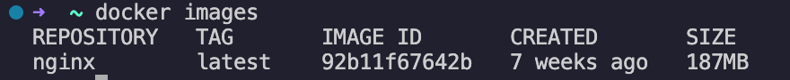

- Запуск докер-образа командой __`docker run -d nginx`__ \
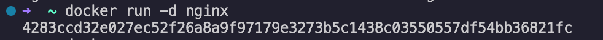
    > Флаг -d запускает контейнер в фоновом режиме.

- Вывод запущенных контейнеров командой __`docker ps`__ \
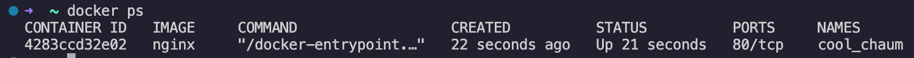

- Вывод информации о контейнере __`docker inspect [container_id|container_name]`__ 
    > В моем случае имя контейнера – _cool_chaum_, id – _4283ccd32e02_. 

- Размер контейнера (для вывода полей с размерами добавляла флаг --size), где \
`SizeRw` – размер файлов, которые были созданы или изменены в контейнере по сравнению с его образом, в байтах \
`SizeRootFs` – общий размер всех файлов в контейнере, в байтах \

- Список замапленных портов и ip контейнера: \
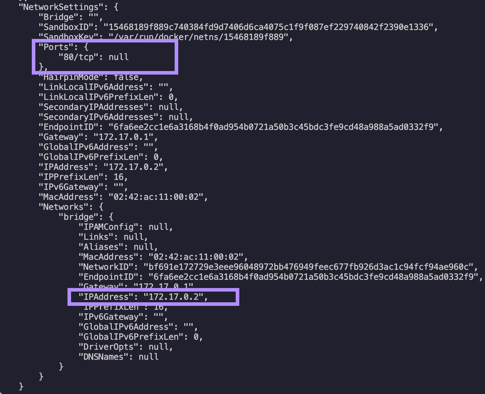

- Контейнер остановлен командой __`docker stop [container_name]`__. Список запущенных контейнеров пуст: \
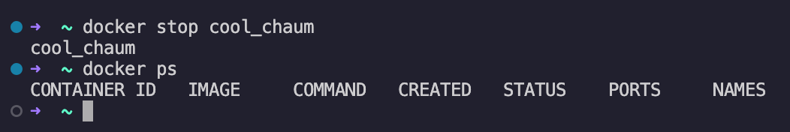

- Запуск контейнера с портами 80 и 443, замапленными на такие же порты на локальной машине, через команду __`docker run -d -p 80:80 -p 443:443 nginx`__: \
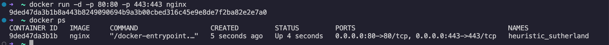 
    > параметры портов указываются с помощью флага -p или --publish по формату: \
    > -p <host_port>:<container_port>/<protocol>

- Теперь в браузере по адресу localhost:80 доступна стартовая страница nginx (то есть произошло подключение к веб-серверу, работающему внутри контейнера): \
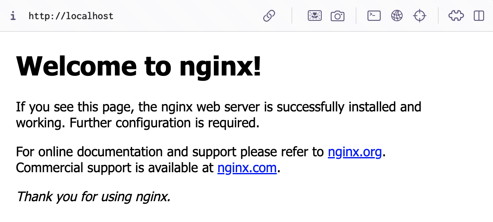

- Перезапуск контейнера командой __`docker restart [container_id|container_name]`__: \
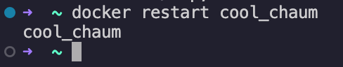

---

## Part 2. Operations with container

Task: Настроить nginx.conf внутри контейнера на отдачу страницы статуса сервера nginx по пути /status. Экспортировать и импортировать контейнер.

- Чтение конфигурационного файла с помощью команды __`docker exec [container_id|container_name] cat /etc/nginx/nginx.conf`__: \
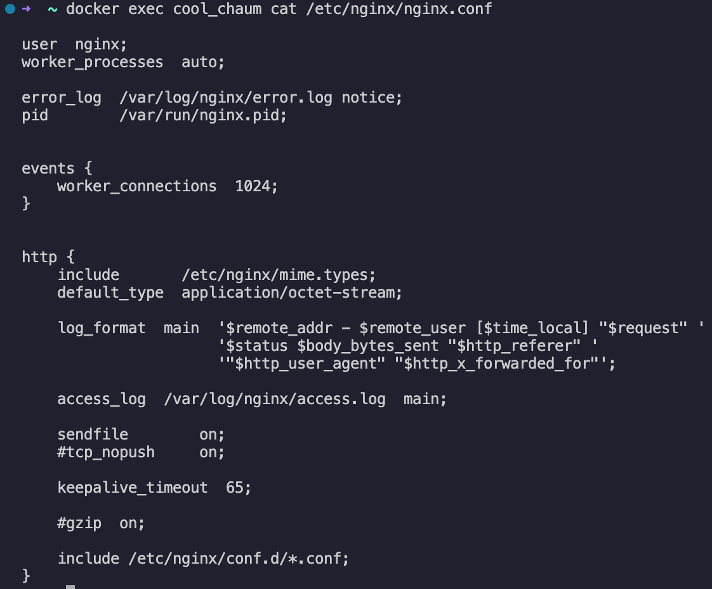

- Локально создан _nginx.conf_ с настройками пути /status с выдачей страницы статуса сервера nginx:
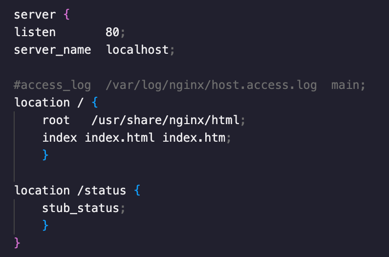

- Созданный файл скопирован в контейнер с помощью команды __`docker cp`__
- nginx перезапущен внутри докер-образа через команду __`exec`__: \
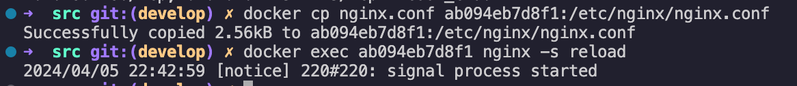

- По адресу __localhost:80/status__ доступна страничка со статусом сервера nginx: \
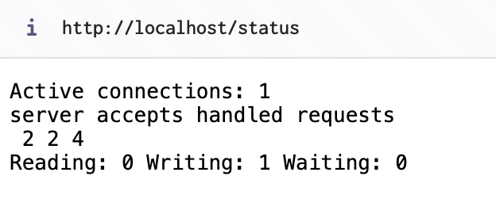

- Экспорт контейнера в файл container.tar через команду `docker export cool_chaum > container.tar`

- Остановка контейнера `docker stop cool_chaum`
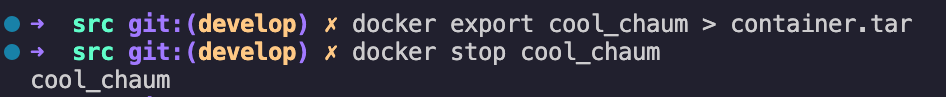

- Удаление образа `docker rmi 92b11f67642b`
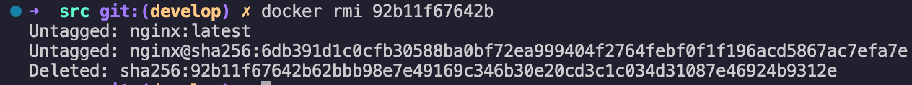

- Удаление остановленных контейнеров `docker container prune`
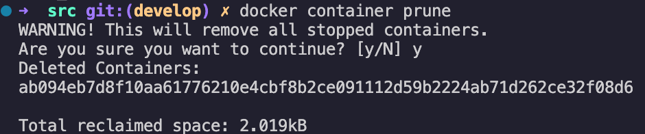

- Импорт контейнера обратно через команду `docker import -c 'cmd ["nginx", "-g", "daemon off;"]' -c 'ENTRYPOINT ["/docker-entrypoint.sh"]' container.tar nginx`
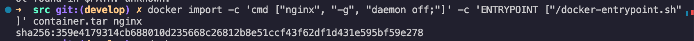

- Запуск импортированного контейнера:
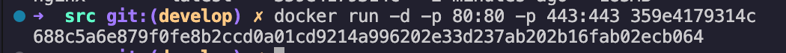

- По адресу localhost:80/status отдается страничка со статусом сервера nginx:
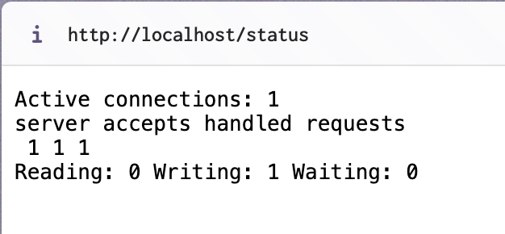

---

## Part 3. Mini-server

Task: Написать мини-сервер на C и FastCgi, который возвращает простейшую страничку с надписью Hello World!. Мини-сервер запускается на порту 8080. \
Также необходимо написать свой nginx.conf, который будет проксировать все запросы с 81 порта на 127.0.0.1:8080.

> FastCGI (Fast Common Gateway Interface) - это протокол, который позволяет веб-серверам взаимодействовать с внешними программами или скриптами для обработки динамического контента.
> spawn-fcgi - это утилита, которая предназначена для запуска FastCGI-процессов. spawn-fcgi обеспечивает удобный способ запуска и управления FastCGI-процессами, позволяя настраивать различные параметры запуска, такие как порт, количество процессов, пользователь, под которым процесс будет запущен и другие.

- Установка FastCGI для C `brew install fcgi` 
- В си-файле подключаем `fcgi_stdio.h`
- Команда для компиляции `gcc -o myserver main.c -lfcgi`
- Запуск написанного мини-сервера через spawn-fcgi на порту 8080:
  - Скачиваем пакет spawn-fcgi:  `brew install spawn-fcgi`
  - команда `spawn-fcgi -p 8080 myserver`
- После добавления информации о проксировании всех запросов с 81 порта на 127.0.0.1:8080 в файл конфигурации запускаем __nginx__
- Браузер по адресу localhost:81 отдает страничку с Hello World

---

## Part 4. Your own docker

Task: Написать докер-образ для созданного сервера.
Докер-образ должен:
1. собирать исходники мини-сервера на FastCgi из Части 3;
2. запускать его на 8080 порту;
3. копировать внутрь образа написанный ./nginx/nginx.conf;
4. запускать nginx.

> Dockerfile описывает какие слои и в каком порядке надо добавить в образ. Каждый слой, кроме последнего, находящегося поверх всех остальных, предназначен только для чтения.
> Только инструкции FROM, RUN, COPY, и ADD создают слои в итоговом образе. Другие 
> инструкции что-то настраивают, описывают или сообщают о необходимости выполнения чего-либо (открыть какой-то порт или выполнить какую-то команду)
> 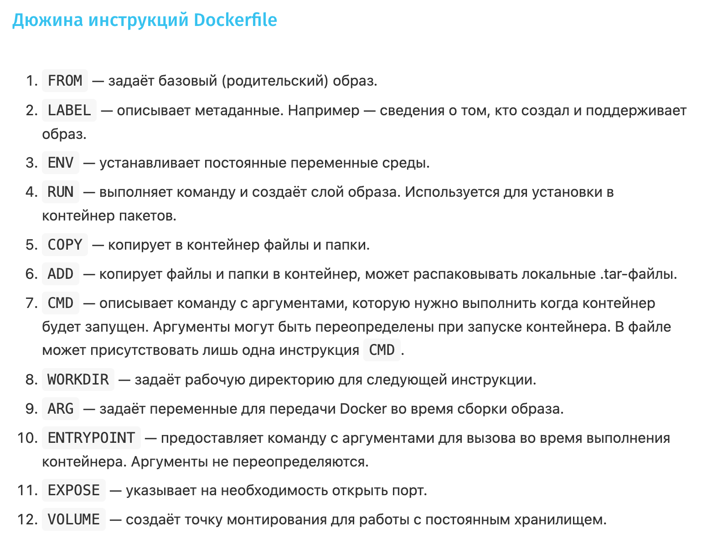
> Источник: [Habr](https://habr.com/ru/companies/ruvds/articles/439980/)

 

- Сборка докер-образа с указанием имени и тега: `docker build -t test:latest . ` 
> docker build -t имя_образа:тег_образа путь_к_докерфайлу

- Запуск собранного докер-образа с маппингом 81 порта на 80 на локальной машине и маппингом папки ./nginx внутрь контейнера по адресу, где лежат конфигурационные файлы nginx'а: `docker run -d -p 80:81 -v ./server/nginx:/etc/nginx --name con test`

- Удаление контейнера, образа и сборка и запуск: `docker rm con ; docker image rm test ; docker build -t test:latest . ; docker run -d -p 80:81 -v ./server/nginx:/etc/nginx --name con test`

---

## Part 5. Dockle

Task: Просканировать образ из предыдущего задания и исправить предупреждения и ошибки.

- Установка в OSX: `brew install goodwithtech/r/dockle`
- Сканирование образа из предыдущего задания `dockle test:latest`
- Добавляем необходимые инструкции и запрашиваемые права в докерфайл, билдим образ `docker build -t test:v1 .`
- Перед сборкой образа на этапе проверки необходимо добавить `export DOCKER_CONTENT_TRUST=1` (затем отключить)

## Part 6. Docker Compose

- Написание docker-compose.yml:
1. web-srv сервис – первый контейнер из прошлых заданий
2. proxy – второй контейнер, который проксирует все запросы с 8080 порта на 81 порт первого контейнера. 8080 порт второго контейнера замаплен на 80 порт локальной машины.
Для второго контейнера прописываем отдельный докерфайл и файл конфигурации nginx.

- Сборка и запуск проекта с помощью команд docker-compose build и docker-compose up